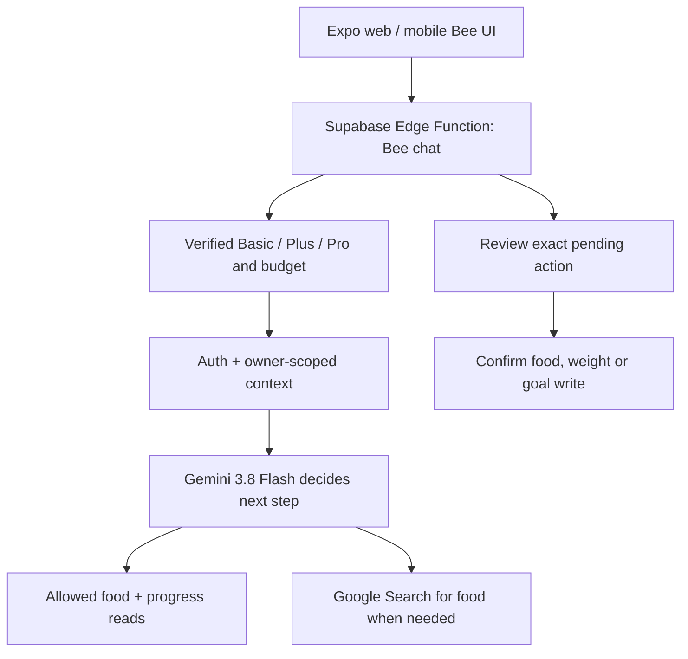

# TrackBing: three-tier SaaS, adaptive Bee, Gemini Search and launch brief

**Combined implementation and launch brief for Codex · updated 27 September 2026**

Build TrackBing as a three-tier subscription product on its Expo web, iOS, and Android clients: **Basic (free manual tracking and manual goal edits), Plus (limited AI-assisted food lookup and quick logging), and Pro (adaptive Bee chat, memory, weight guidance and suggested goal changes).** Replace DeepSeek and Tavily in the existing AI food path with Gemini. **Bee must assess the user's request and real app state to decide its next response or proposed action. It is not a menu of fixed Bee dialogues.** Paid AI plans can use live Google Search for food questions that permitted nutrition sources cannot resolve. Save user-controlled memory; write to the diary/profile only after the user reviews and confirms the exact proposal. **In the same implementation, apply all 20 launch checks to TrackBing as a whole**, including the public website and native apps where relevant. The complete numbered checklist is below.

**Status:** This document is an implementation specification. It does not claim that the migration has been coded, deployed, or verified.

## Instructions to the implementing Codex agent

1. Read the repository's `AGENTS.md`, `README.md`, `PRODUCT.md`, `package.json`, `app.json`, `vercel.json`, CI workflow, existing AI/food code, migrations, and tests before editing. Check git status and preserve uncommitted user work. Follow its security and verification rules.
2. Implement Basic/Plus/Pro subscriptions and server-enforced entitlements, the adaptive Bee assistant, food lookup/logging, weight check-ins, Gemini migration, **and each of the 20 launch checks** in the existing Expo + Supabase stack. Make routine engineering decisions without interrupting the build. Preserve existing food logs, nutrition calculations, legitimate paid entitlements, visual identity, and client support. Audit each launch item as already verified, partial, missing, or dependent on real operator/deployment information before changing code.
3. Treat the *current* Google documentation and service terms as authoritative at implementation time. Check model availability, prices, grounding attribution requirements, and data use restrictions again before release. The prices below are a dated planning snapshot.
4. Do not invent nutrition/weight values or progress, attribute unverified values to sources, reuse Google Search grounded results as a shared food database, or let AI generated text authorize a database write. The model chooses which read-only capability to request and what to say; only trusted server code performs validated actions after the user's approval.
5. Finish with changed files, migrations, billing provider setup/handoff, environment variables, test results, a manual web/mobile walkthrough of all three tiers and purchase/restore/downgrade paths, a **20-row item-by-item launch status table**, remaining limitations, and a security review. Distinguish local implementation from production verification; do not claim live payments or production deployment unless actually verified.

## SaaS plans and prices (Philippine launch proposal)

The paid subscription unlocks cloud AI features on the user's **one TrackBing account** across web and mobile. Store prices are proposed in Philippine pesos; configure the real storefront price points in App Store Connect and Play Console and show their actual localized prices at checkout. Do not make manual food/weight tracking or manual goal edits paid.

| Capability | Basic — free | Plus — ₱249/month or ₱2,490/year | Pro — ₱599/month or ₱5,990/year |
| --- | --- | --- | --- |
| Manual food diary, weight check-ins, dashboard, user foods/recipes, manual goal and target edits, existing non-AI barcode/database search | Yes | Yes | Yes |
| Bee visual mascot | Static/local UI and deterministic guidance; zero Gemini calls | Static/local UI outside food assist | Adaptive text and context-aware pose for chat and insights |
| AI-assisted food lookup and proposal to log an exact serving | No | Up to **60** one-shot requests/month | Included in **250** total Bee interactions/month |
| Live Google-grounded food searches (query units actually executed) | No | Up to **10** queries/month within the 60 requests | Up to **50** queries/month within the 250 interactions |
| Open-ended Bee chat, proactive next-step suggestions, dated weight interpretation, AI-assisted weigh-in proposals | No | No | Yes, within the 250-interaction budget |
| AI-proposed goal/target edits, explicit memories and personalized dashboard insights | Manual goals only; no AI memory | Manual goals only; no AI memory | Yes, up to **30** refreshed dashboard insights/month; goal writes require a separate confirmation |
| Monthly Gemini budget across all use (including Search and insights) | Zero | **160k input / 50k output tokens** | **800k input / 200k output tokens** |

**One interaction** is one user-triggered AI request, including food quick log or a Bee chat message; an automatic provider retry stays within the same request but counts its actual tokens/search queries. Non-AI manual edits, history reads, purchases, confirmations and a user's access to previously saved diary entries do not consume interactions. The insight allowance and token budget limit background model calls; don't call Gemini on every render. Show remaining requests, Search queries, insight refreshes, and a plain-language warning when the token allowance is nearly reached. Explain the monthly token fair-use limit on the paywall before purchase, since long inputs and multi-step answers can use it before the request allowance. Never promise unlimited AI. No paid add-on or metered overages at launch. Reset counts on the subscription's billing anniversary (monthly or equivalent monthly allowance for annual plans); use one account-wide meter for web/iOS/Android with an auditable UTC period key and clearly display the user's renewal/reset date. Reconcile late provider events without giving out overlapping free months. Denied AI requests should show the relevant upgrade/renewal message while leaving manual tracking available.

**Basic stays useful:** A user can choose a known food from existing independent/approved sources or enter their own food manually, log weight and change their own goals at no subscription cost. Existing normal non-AI food search may need bounded anti-abuse controls. A Bee mascot may still appear in Basic/Plus, but contextual generated conversations, persistent AI memory and AI goal reviews are Pro-only. If a legacy plan already grants paid access, honor its verified paid period/contract terms during migration and show the effective tier; communicate the removal of the old seven free AI lookups before rollout. Do not assign Pro based solely on a client value or self-reported `pro_until`.

**Goal authority:** Pro Bee can calculate a proposed goal change from real profile/weight data and the trusted `nutritionTargets.ts` rules, then show old and proposed calories, macros, goal mode and weight targets. The user must explicitly accept that **specific** change; the server validates and saves it once. A user's typed “yes” to an unrelated message is not consent. All three tiers can always edit goals themselves in Profile with normal server validation. A downgrade does not undo saved goals, logged food, weight history or explicit user memories; it disables further paid AI features and lets the user export/delete data as allowed.

## The experience to build

**Example A: a common food (Plus or Pro AI; Basic can make the same entry manually)**

> User: “How many calories in 72 grams of boiled egg?”
>
> Bee: Finds a matching **cooked/boiled** food record from an independently usable nutrition source. Scales its per-100 g energy to **72 g** on the server, shows the source and an appropriate confidence label, then asks, “Add 72 g of boiled egg to today's food?”
>
> User: “Yes.”
>
> Bee: Writes exactly that reviewed serving to that user's food diary once and confirms the saved entry.

**Example B: a Philippine branded product (Plus food assist or Pro Bee chat)**

> User: “Calories in one Fudgee Barr?”
>
> Bee: Asks for the flavor and bar/package size if those affect the result. Checks an independently usable product record first. If no reliable record exists, gets a **live Google-grounded answer** with visible citations and the required Search Suggestions. If the available evidence cannot verify the exact product and nutrition panel, Bee says so and offers barcode, package-label photo/manual entry, or another matching product. Do not output a made-up calorie figure.
>
> Bee: Offers “Add to today's food” only when it has a reviewed, loggable serving from an independently reusable source or from a user-provided label/manual entry. “Yes” saves that exact item through a server-owned confirmation action.

**Example C: a weight update and a relevant next step (Pro; Basic/Plus can record weight manually)**

> User: “My weight today is 72.4 kg. What should I do next?”
>
> Bee: Checks the signed-in user's goal, previous **recorded** weigh-ins, and recent food-log summary. It asks a short question if “72.4” or its unit/date is unclear. It shows “Save 72.4 kg for today?”; it does not claim the profile changed yet.
>
> User: “Yes.”
>
> Bee: Saves **one** timestamped weigh-in and updates the current profile weight through an atomic server action. It describes a weight trend only if there are enough real measurements, then suggests **one relevant next step** grounded in the user's actual goal and data, such as logging an unlogged meal, reviewing a nutrition goal, or simply continuing normally. It does not alter calorie targets without a separate explicit review and approval.

The search answer and the diary action must have distinct states. A user may ask a question without logging anything. If a Google-grounded answer is the only evidence, resolve the data-use restrictions described below before enabling a direct “yes” write sourced from that answer.

## Bee's job: choose the next useful step

Pro Bee is a **conversational coach and action planner**, not a fixed question-to-dialogue table. A helpful answer can be a direct explanation, one clarification, a source-backed lookup, a factual progress summary, an optional suggestion, a proposal for a user-approved write, or a warm acknowledgement with no proposed action. Do not force a food log or weigh-in into every conversation. Plus's food helper may interpret food/portion and propose logging, but **cannot** invoke Pro chat, weight coaching, goal changes, long-term AI memory, or ongoing personalized insights.

| User/context | Bee's possible next step | Trusted data/action boundary |
| --- | --- | --- |
| “How am I doing today?” | Read today's real food logs and stored targets; summarize known values; ask what the user wants help with if needed. | Queries, arithmetic, and dates happen server-side; no imagined logs or medical claims. |
| “I ate an egg” | Clarify size/preparation/amount only if needed; resolve nutrition; propose the exact log. | Food values come from a permissible source; server saves only after confirmation. |
| “I'm 72.4 kg today” | Confirm unit/date and propose a weight check-in. | Show exact kg and local date before an atomic weight write. |
| “Should I change my calorie goal?” | Review current goal mode, target, relevant logged trend and existing calculation, then explain options. | Reuse `nutritionTargets.ts`; propose any goal change separately; never adjust silently. |
| “What should I do next?” | Choose **one** useful, optional suggestion based on recent verified food, weight history and expressed goal; sometimes no nudge is appropriate. | Do not infer missing data means the user did not eat or weigh in; no automatic background writes. |
| Pro: “Remember I use cooked rice portions” | Explain what will be kept and store an explicit preference. | Owner-only memory; allow view, edit and forget. |

**Decision loop:** Authenticate → resolve the verified tier and reserve a request budget → load a small, fresh, owner-scoped context snapshot (goal mode/target, today totals, recent log times, latest available weigh-ins, user-approved preferences and active pending action) → Gemini proposes intent, needed *read-only* tools and the next response → server checks that the tier permits those tools and runs approved reads/calculations → Gemini produces a concise natural reply plus a typed suggested action/mascot situation → server validates citations, scope, state and permissions → if a write is proposed, show a concrete pending review card → only the user's later confirmation executes an idempotent server write. Basic stops before any Gemini call; Plus uses the restricted food-assist branch without loading private goal/weight context. Bound tool steps and latency; there must be a normal exit when no tool or follow-up is useful. Never trust a user message, earlier assistant text, website, or remembered preference as permission to bypass the write boundary.

**Dynamic dialogue and mascot:** For Pro, replace the fixed dashboard coaching in `src/lib/beeCoach.ts`, repeated Quick Log chat copy in `src/components/ai/BeeQuickLog.tsx`, and the tap reaction lines in `src/lib/beeCompanion.ts` where they currently act as Bee's substantive responses. Generate short, context-specific Bee text through the assistant for Pro dashboard and chat. Preserve deterministic loading/errors, safety messages and an offline fallback when the API is unavailable or the tier forbids AI. Keep the existing eight illustrated poses in `src/components/ai/BeeGuide.tsx`; the assistant can suggest a semantic state such as `thinking`, `searching`, `encouraging`, `success` or `caution`, and the server/UI maps it to an approved pose after validation. The art assets do not have to be generated anew for every line. A mascot tap should open the relevant Bee interaction or reuse a recent valid insight rather than repeatedly hitting Gemini or cycling canned coaching lines.

**Dashboard insight cost/quality:** Pro only: generate a new owner-scoped, non-search Bee insight when underlying user data or the relevant local day changes, or when the user requests one, within the 30-refresh and token budgets; do not make an API call on every render/animation. Store the minimal generated insight with context-version/expiry for that user if permitted. If the insight cites a Google-grounded answer, follow the separate grounded-result restrictions below and do not put it in a reusable cache. Verify freshness before suggesting a next step.

**Boundaries:** Weight, food and goal data are private; send Gemini only the fields needed for the present request. Avoid shame, crash-diet advice, unsupported interpretations of a short-term weight fluctuation, or extrapolated weight-loss rates from one measurement. Respect the existing age/goal safeguards in `nutritionTargets.ts`. Bee may choose *what to suggest* but cannot autonomously send notifications, change targets, record measurements, or write foods without the specific user's reviewed action.

## A critical correction to the earlier proposal

An earlier outline suggested storing Google-grounded nutrition answers as a reusable TrackBing food cache for later users. **Do not implement that cache.** Google's current [Gemini API Additional Terms](https://ai.google.dev/gemini-api/terms) restrict caching, analysis, collection, and reuse of Grounded Results, Search Suggestions, and Links. The limited text-storage exceptions include an individual user's chat history for displaying it back to that user; they do not authorize a general food database or automated collection of Google Search links to crawl later.

The safe architecture is:

| What is stored | Source and purpose |
| --- | --- |
| Reusable product/nutrition records | Independently obtained records with appropriate rights: USDA FoodData Central, Open Food Facts under its license and attribution requirements, directly licensed feeds, or user-owned records as appropriate. Review each source's terms. |
| Google-grounded answer | Show only to the requesting user with Google's required attribution and Search Suggestions. Retain only in that user's viewable chat history if the current terms allow it, with a bounded retention period and deletion control. Never promote it into a shared nutrition index. |
| User food log | The user's explicitly confirmed personal diary entry, using a source that can be recorded under its terms or values the user supplied. Review the applicable provider terms before persisting values that came solely from a Google-grounded result. |
| User memory | Explicitly saved preferences or safe, clearly explained profile context, private to that account; never a copy of a Google search corpus. |

**Do not use Google-grounded links as an automated lead list for scraping.** For a reusable Philippine product dataset, integrate an independently licensed food source or product feed, or let users submit package labels with appropriate consent and review. This is an important product dependency for the “Google found it → yes → add it” experience on products missing from existing databases. Get the final interpretation of provider terms reviewed before shipping that exact flow; do not silently bypass it.

## Repository map from inspection

| Area | Existing location | Action |
| --- | --- | --- |
| Authenticated food lookup | `supabase/functions/ai-food/index.ts` | Migrate DeepSeek parsing and Tavily “Find more” to Gemini; enforce Plus/Pro only for AI, keep Basic manual source search available, and preserve authorization, rate limiting, source comparison, and response compatibility while changing behavior. |
| Nutrition validation | `supabase/functions/_shared/macros.ts`, `candidates.ts`, `webNutrition.ts`, `foodSearch.ts` | Reuse/adjust genuine validation and candidate ranking. Replace Tavily-specific parsing rather than treating Google citations as a licensed data feed. |
| USDA lookup | `supabase/functions/usda-search/index.ts` | Keep where valid; preserve source IDs, match type, cooking state, and serving basis. |
| Client API | `src/lib/aiFood.ts`, `src/lib/foodSearch.ts` | Preserve existing `AiFood` consumers, add explicit provenance and states without a breaking change to unrelated screens. |
| Bee chat and confirmation | `src/components/ai/BeeQuickLog.tsx`, `src/lib/beeQuickLog.ts` | Move pending proposal and “yes” authorization to the server. Today `pendingFood` lives only in component state and confirmation inserts directly from the client. |
| Bee dashboard and mascot | `src/lib/beeCoach.ts`, `src/lib/beeCompanion.ts`, `src/components/ai/BeeGuide.tsx`, `src/screens/DashboardScreen.tsx` | Replace substantive template-based coaching and tap lines with context-aware AI insight; keep validated pose selection, accessibility and deterministic fallbacks. |
| Body weight and targets | `src/screens/ProfileScreen.tsx`, `app/(tabs)/stats.tsx`, `src/lib/nutritionTargets.ts`, `user_goals` | Profile currently stores `current_weight` and `target_weight`. Add dated owner-scoped weigh-in history and keep profile weight synchronized; reuse existing validated target calculation instead of asking Gemini to invent targets. |
| Diary and totals | `food_logs`, `src/lib/dailySummary.ts`, `src/lib/foodLogEvents.ts` | Keep the current food log shape and ensure a successful AI log updates the visible daily totals on web and mobile. |
| User auth and budgets | `supabase/migrations/20260624000000_enable_rls_user_tables.sql`, `20260629000000_add_ai_and_entitlements.sql`, `20260629000100_ai_usage_increment.sql`, `supabase/functions/_shared/quota.ts` | Migrate the existing `pro_until`/free-seven/Pro-100-per-day lookup system to verified Basic/Plus/Pro subscriptions, typed capability gates and atomic account-wide quotas. Keep existing abuse controls and honor legitimate paid periods. |
| Paid checkout | No verified working billing integration found in inspected repository | Implement platform-correct subscriptions, webhook/receipt verification, restore/manage flows and cross-device entitlement reconciliation before marking payments live. |
| Local draft code | `_shared/beeChatProtocol.ts` and `_shared/beeNutrition.ts` if present in the working tree | Inspect and reconcile instead of overwriting. These appeared as **untracked drafts** in the inspected checkout; they are not proof of a deployed chat backend. |

TrackBing is an Expo Router / React Native project serving web and mobile from the same codebase, with Supabase Auth, Postgres, and Edge Functions. Use that shared client to call **one authenticated server API**. Do not put a Gemini API key or Google Search requests in the web bundle or mobile app.

## Target architecture



- Gemini decides which *allowed* read or response would help and proposes a next action using real, fresh owner-scoped context; the server validates tier, tool selection, data scope, arithmetic, and every write. Basic requests never reach Gemini; Plus can only access the food-assist tool subset.
- Read permitted structured food records first; ask about missing flavor, package size, weight, preparation, or portion when the ambiguity affects the nutrition value.
- Enable Google Search **only on an explicit search branch**. The model may choose one or multiple search queries once enabled. Do not search for greetings, existing diary totals, or a valid direct food hit.
- Keep source selection and arithmetic in trusted server code. Gemini interprets intent and drafts user-facing text; it does not get authority to invent macros or execute writes.
- Do not add pgvector as a prerequisite. Exact fields, indices, and owner-scoped SQL queries are sufficient for food records, diary history, and explicit preferences. Add semantic retrieval only for a demonstrated need and data you may index.

## Gemini integration

**Bee's main model:** `gemini-3.8-flash`, configurable with `GEMINI_MODEL`. This is the stable, stronger Flash model Google documents for agentic workflows; it supports thinking, function calling and Google Search grounding. Start with its default `medium` thinking for multi-step Bee decisions. Try `low` for measured simple-turn latency and `high` only for demonstrably hard cases; `minimal` is unsupported on this model. Use `gemini-3.5-flash-lite` only as an **optional, measured helper** for narrow extraction/classification, never as the sole assistant deciding progress advice, memory, or next actions. The model choice does not replace server-side tool boundaries or deterministic nutrition/goal calculations. [3.8 Flash model](https://ai.google.dev/gemini-api/docs/models/gemini-3.8-flash/) · [Thinking levels](https://ai.google.dev/gemini-api/docs/thinking) · [Grounding](https://ai.google.dev/gemini-api/docs/google-search)

**Google API path:** Implement a small server-side Gemini adapter behind a stable TrackBing interface. The current [Interactions API](https://ai.google.dev/gemini-api/docs/interactions-overview) supports Search and inline `url_citation` annotations. Its Google Search REST example uses `POST https://generativelanguage.googleapis.com/v1beta/interactions`, `x-goog-api-key`, and `tools: [{"type":"google_search"}]`. An SDK is optional; use the Edge Function compatible approach that survives local tests. If you use the older `generateContent` endpoint, its response uses `groundingMetadata` / `groundingSupports` / `groundingChunks` instead. **Write one adapter for the chosen API; do not mix response formats.**

Example *shape*, not a full Edge Function:

```json
{
  "model": "gemini-3.8-flash",
  "input": "Find nutrition evidence for this exact product, market, flavor and serving: ...",
  "tools": [{ "type": "google_search" }],
  "store": false
}
```

- Set `store: false` if using Interactions API and managing minimal conversation state in TrackBing. Google notes that Interactions otherwise stores state by default; separate 30-day Google Search grounding processing still applies. Never send the full user profile or food diary to Search when only the product query is needed. [Interactions storage](https://ai.google.dev/gemini-api/docs/interactions-overview) · [Grounding data use](https://ai.google.dev/gemini-api/terms)
- Extract `google_search_call` query counts, `model_output` text and its `url_citation` annotations, and `google_search_result` Search Suggestions. Render source links from Google's citation metadata, never from URLs invented in the model's plain text. Meet Google's Search Suggestions and display requirements; keep app buttons outside the grounded answer. Do not store grounded links as a harvesting list. [Grounding response](https://ai.google.dev/gemini-api/docs/google-search)
- Use a separate no-search model turn for classification/structured planning when it makes the flow safer. Google's combined structured-output-with-tools feature is preview and model-specific; validate against the *selected* 3.8 Flash API path before relying on it, and validate the result shape server-side regardless of model output. [Structured outputs](https://ai.google.dev/gemini-api/docs/structured-output)
- Google's combined built-in Search plus custom function calls are currently a **preview** capability for Gemini 3. This feature does not require giving the model permission to write a diary. Keep food logging as a deterministic server action after confirmation. [Tool combinations](https://ai.google.dev/gemini-api/docs/tool-combination)
- Treat Search text and retrieved food names as untrusted data. Do not follow instructions in a webpage or use user-supplied URLs for server fetches without allowlist, HTTPS, and private-network checks. Limit payload sizes, timeouts, output tokens, and retries.

## Nutrition resolution and evidence

1. Parse and normalize the user's intent, quantity, unit, preparation, exact product name, brand, flavor, market, and barcode if supplied. Do not silently turn “1 bar” into 38 g. “72 g” means edible grams of the specified state, not a raw/cooked substitution.
2. Query the authenticated user's `personal_foods` and known items, then the independent USDA and Open Food Facts paths already in TrackBing. Reject weak string matches across brands, flavors, preparation methods, or package sizes. Confirm an ambiguous match before quoting or logging it.
3. For an independently sourced match, normalize the values to a known basis (`per_100g`, `per_bar`, `per_label_serving`) and compute the requested portion on the server. Keep energy/macros nullable where the source does not state them; do not replace missing protein/carbs/fat with confident zeroes. Preserve the original quantity and the conversion method.
4. On a miss or an explicitly requested web lookup, call Gemini with Google Search for a **live, user-visible grounded answer**. Ask for the exact variant if necessary. A citation to a page that does not actually support the stated calories is insufficient; without a checkable nutrition label, avoid a precise claim. Distinguish a clearly labeled estimate from a verified value.
5. For a subsequent log proposal, use a separate independently usable source for values, or let the user provide/confirm their own label/manual values. If that cannot be done, offer the answer with citations but explain why Bee cannot yet save a verified entry. A confident model response alone must not become reusable structured food data.
6. If reusable data is intentionally stored, save source ID, license/attribution where required, product variant, serving basis, `checked_at`, and `needs_review`/expiry policy. **Never create these records from the Google-grounded answer or its links.**

The existing `validateAndNormalize` clamps bad values and substitutes defaults for missing serving grams. Tighten the logged-food path: reject invalid or unknown serving conversions instead of silently converting unknown grams to 100 g; allow `null` for unsupported macros, or require complete evidence before logging according to the existing schema. Review any change to `ai_estimated` so labels in the diary remain honest.

### Suggested server result contract

```ts
type FoodEvidence = {
  foodName: string;
  brand: string | null;
  variant: string | null;
  requestedQuantity: number;
  requestedUnit: "g" | "bar" | "serving";
  servingGrams: number | null;
  kcal: number | null;
  proteinG: number | null;
  carbsG: number | null;
  fatG: number | null;
  evidenceKind: "usda" | "open_food_facts" | "licensed" | "user_label" | "google_grounded" | "estimate";
  canProposeLog: boolean;
  matchStatus: "exact" | "ambiguous" | "unverified";
  // Source refs are user-facing citation metadata. Do not reuse Google refs for a shared index.
  citations: Array<{ title: string; url: string }>;
  explanation: string;
};
```

Use runtime validation for every external response. `canProposeLog` must be computed by server policy, not returned by Gemini as an authority. Be careful when adapting this contract to `AiFood`: current callers expect finite numbers and a `serving_grams`; introduce an explicit “answer only / needs input” branch rather than inventing defaults.

## Weight history, progress and goals

Weight updates are a first-class Bee task, with the same cross-device continuity as food logs. Currently `user_goals.current_weight` is overwritten on Profile save; a single value cannot answer “How has my weight changed?” reliably. Add a small, owner-scoped `weight_logs`/`weight_checkins` table rather than inventing history from the latest value. If an equivalent table already exists on the implementing branch, adapt it instead.

1. Accept `kg` and `lb` with an explicit/confirmed unit, optional measurement date and the user's timezone. Convert to canonical kg on the server using existing `lbToKg` or its equivalent in `nutritionTargets.ts`; display the user's chosen unit without losing the stored precision. Apply the existing `STAT_LIMITS.weightKg` as an initial validation rule and use a clearly explained path for legitimate values outside its range rather than silently clamping. Distinguish body weight from a food serving's grams in the intent planner.
2. Before any write, show a pending card with weight, unit, recorded day and whether it will update `user_goals.current_weight`. “Yes”/tap Confirm saves it once; “no”/Cancel saves nothing. A correction (e.g., “I meant 72.4 lb”) replaces the pending card; an unrelated “yes” must not write anything.
3. Save the weigh-in and synchronize `user_goals.current_weight` in one atomic server transaction/RPC. Backdated entries belong in history, but should update current profile weight **only** if they become the latest measurement. Use an idempotency key for retries/double taps. Editing/deleting a weigh-in recomputes the current profile weight from the latest remaining measurement or a clearly identified baseline; never leave stale derived values.
4. Offer the same weight history and edit/delete path in Profile/Stats so Bee is not the only way to manage it. Seed a **clearly marked baseline** from an existing current weight if appropriate; do not invent historical dates or duplicate a baseline every time Profile is saved. Future manual Profile edits and Bee check-ins must use one coherent persistence path.
5. Read actual weigh-ins for trend explanations: include dates, quantity, units, goal direction, and explicit uncertainty. With fewer than two comparable measurements, say there is no reliable trend. Short-term fluctuations are normal; do not claim a causal link to a meal, diagnose health conditions or suggest aggressive restriction.
6. An update to body weight must **not silently change** `target_weight`, `goal_mode`, calorie or macro targets. For “adjust my goal,” compute the suggested result with the existing `nutritionTargets.ts` logic and age safeguards, show the old and proposed values, and require a separate explicit confirmation before any target mutation. For underage users, respect the repo's existing minor-maintenance rules. Handle missing profile fields by asking rather than filling them with model guesses.

Examples of the actual next action Bee may choose: **ask** for a missing weight unit; **read** this week's measurements; **propose** a check-in; **answer** a general question; **offer** a goal review; or **stop** after a useful answer. These are intent decisions, not prewritten utterances. The UI should reflect a validated semantic Bee situation and the generated response, including on the dashboard.

## Bee conversation, memory, and approved writes

Use a single Edge Function, for example `bee-chat`, called through `supabase.functions.invoke()` from the existing Expo client. Keep `ai-food` compatible during migration or migrate its callers deliberately. On every AI action, load the verified entitlement **server-side** before invoking the model. Support:

| Action | Input | Server response / effect |
| --- | --- | --- |
| `message` | Text, client request ID, optional thread ID; account timezone already saved or validated | Pro-only dynamic Bee reply, validated mascot situation, evidence/citations, one clarification, optional next-step suggestion, or server-created pending proposal. No food, weight or goal write. Plus uses an explicitly restricted `food_assist` action. |
| `confirm` | Opaque pending ID + idempotency key | Atomically validate owner, expiry, current state, action kind and reviewed payload; save **exactly one** food, weight or separately approved goal change; return the saved result. |
| `cancel` | Pending ID | Expire it; leave food, weight, and goals unchanged. |
| `history` / `progress` | Date or bounded range | Read only the signed-in user's food logs, recorded weigh-ins and goals; calculate dates/totals/trends in trusted code. |
| `remember` / `forget` | Explicit user request and specific permitted preference | Pro alone can create AI memory; owner can always view/export/delete their own previously saved memory after downgrade. |
| `load` / `clear` | Thread ID | Restore or clear user-visible conversation within the chosen retention policy. |

**Pending state:** Persist `user_id`, `pending_id`, `action_kind: food | weight | goal`, a validated and versioned proposed payload, displayed summary, source and relevant dates, `created_at`, `expires_at`, `status`, and `request_id` in a private table. A changed portion, weight or goal invalidates the old proposal. Show the exact data that will be written. A simple “yes” applies only to the current active proposal; “no” cancels; “make it 100 g” starts a new lookup/proposal. An unsolicited “yes” does nothing. Where several actions could be intended, ask which one before interpreting confirmation.

**Atomic write:** Use a Postgres transaction/RPC or equivalent database-side operation to lock and consume the proposal, verify the caller's identity, originating tier/capability and action kind, apply the typed write with a unique `(user_id, pending_id)` action key, and return the existing result on replay. The service role must never trust client-supplied macros, weight, goal, `user_id`, or date in the confirmation request. Preserve the `food_logs` columns expected by `buildAiFoodLogInsert`; add nullable provenance/action columns only through migrations. Retry and double-tap must never create duplicate foods or weigh-ins. Permit a previously approved and still valid proposal to finish after a billing boundary only if its creation and confirmation both satisfy the documented policy; downgrade must never enable a new Pro goal proposal.

**Today:** Resolve the diary date from the authenticated user's saved IANA timezone if present, otherwise a validated client timezone (such as `Asia/Manila`), at the time of confirmation. Use the same date convention as TrackBing's dashboard and daily summary. If the proposal crosses midnight, show or ask about the affected date instead of silently changing the promised day. Recompute or refresh the daily summary and emit the existing food-log-changed event on client success.

**Memory:** Keep distinct concepts:

- Thread: short, owner-scoped chat history for continuity; bounded length and retention. Google-grounded history may be stored only for the displaying user's own history within the provider's current exception and must not be fed into a shared search index.
- Preference: explicit, editable facts such as “I usually measure rice cooked” or preferred units; store key/value, source, timestamps, and delete control. Do not infer health diagnoses, allergies, or permanent facts from one meal without an explicit save request.
- Diary: authoritative `food_logs`; retrieve actual records for “What did I eat today?” rather than relying on the model's recollection.
- Body weight and goals: authoritative `weight_logs` plus `user_goals`; retrieve actual records and validated calculation results instead of treating a chat message as a recorded measurement.

Default to read-only context plus explicit opt-in for new long-term memories. Add a “Memories” view/control if memory is implemented, with delete and clear options. Scope reads/writes by authenticated `user_id` and owner-only RLS. A cross-user account test is mandatory.

### Agent plan and tool boundary

The model generates fresh wording and chooses the next step. A typed plan should express its **intent**, not a hardcoded dialogue script. Use an approach similar to this and validate it at runtime:

```ts
type BeeDecision = {
  reply: string;
  nextStep: "answer" | "ask_one_question" | "read_data" | "lookup_food" |
    "search_food_web" | "propose_food" | "propose_weight" |
    "propose_goal_review" | "remember" | "nothing_more";
  requestedRead?: "today_food" | "weight_history" | "current_goal" | "preferences";
  suggestedPose: "greeting" | "thinking" | "encouraging" | "celebrating" |
    "caution" | "resting" | "searching" | "success";
  followUpQuestion?: string;
};
```

The enum is an **allowlist of capabilities and local pose assets**. It must not become a table of canned sentences. A server policy decides whether requested reads are necessary/authorized and whether a log proposal has complete, legally usable data; unapproved tool calls are ignored or rejected with a safe explanation. Model output alone never triggers a write. Limit the read/tool loop (for example, a few steps per message) and summarize results back to the model only when needed. A sign-in change or thread switch clears the active pending context.

### Example wire exchange

```json
{"action":"message","text":"72 g boiled egg calories?","request_id":"<uuid>","timezone":"Asia/Manila"}
```

```json
{
  "reply": "Nutrition from a matched boiled egg record. Add 72 g to today's food?",
  "evidence": {"kind":"usda","sourceId":"<record-id>","servingGrams":72},
  "pending": {"id":"<uuid>","expiresAt":"<ISO timestamp>"},
  "citations": []
}
```

The numeric calories/macros in a real response must be calculated from the actual source; the examples intentionally contain **no invented food values**. For a Google-grounded response, return its cited text and Search Suggestions, with `pending: null` unless a separate permissible log source exists.

Weight example with the same protocol:

```json
{"action":"message","text":"I weighed 72.4 kg this morning. What should I do next?","request_id":"<uuid>","timezone":"Asia/Manila"}
```

The response includes a fresh Bee `reply`, a semantic `suggestedPose`, and a pending `kind: "weight"` with exact weight/unit/local date and expiry. A later `{"action":"confirm","pending_id":"<uuid>","request_id":"<uuid>"}` returns the saved weigh-in; only then does Bee discuss recorded progress and offer a next step based on verified food/weight/goal data. This example intentionally assumes no previous weights and claims no trend.

## Suggested migrations and access rules

Create the smallest tables the implementation actually needs. Recommended shapes:

| Table | Essential columns and index | RLS / lifecycle |
| --- | --- | --- |
| `bee_threads` / `bee_messages` | `id`, `user_id`, `thread_id`, role/content, timestamps; index `(user_id, thread_id, created_at)` | Owner reads/deletes; limit history; distinguish Google-grounded text and apply its display-only retention exception. Avoid storing full external search steps or suggestions as a searchable data collection. |
| `bee_memories` | `(user_id, key)` unique, value, `created_at`, `updated_at` | Owner can read/export/delete after downgrade; creating or editing AI memory is server-gated to Pro and requires explicit save. |
| `bee_pending_actions` | `id`, `user_id`, `action_kind` (food/weight/goal), typed or validated JSON payload, timestamps, expiry, status; index `(user_id, status, expires_at)` | Only owner may view/confirm; service-only controlled write; expire old rows. Reuse or migrate an existing food-only pending table if one was already created. |
| `weight_logs` | `id`, `user_id`, `weight_kg`, `measured_at`, original/display unit if needed, `created_at`, unique `(user_id, ai_action_id)` where present; index `(user_id, measured_at desc)` | Owner read/write/delete with validation and clear baseline/current-weight sync; an AI action has exactly one write. |
| `food_logs` extension | Nullable `ai_action_id` or equivalent unique `(user_id, pending_id)` mapping, optional independent provenance fields | Preserve existing logs and policies; one confirmed pending action yields one log row. |

If a table already exists in a branch, reuse it. Write forward-only migrations, appropriate check constraints/indexes, owner-scoped RLS policies, and restricted atomic confirmation RPC(s) for each write kind. Don't expose broad service-role table endpoints to clients. **Replace** the old binary `pro_until` + seven free AI lookups + 100 daily Pro lookup logic with the verified three-tier capabilities and monthly budgets below; ensure each Search query cost is measured independently from app request quotas. If per-user dashboard insights are stored, give them owner-only access, a context revision, a short expiry and no Google-grounded shared cache behavior.

## Subscriptions, verification and paywall implementation

**Payment routes:** Use [PayMongo Subscriptions](https://www.paymongo.com/products/accept-payments/subscriptions) or another operator-approved Philippine recurring provider for **web checkout**. Check the provider's live methods during integration: its current subscriptions page says automated recurring billing supports **Maya and credit cards**, not GCash; do not promise recurring GCash until the provider verifies it. Use **StoreKit auto-renewable subscriptions** for iOS in-app purchases and **Google Play Billing subscriptions** for Play-distributed Android in-app purchases. Do not insert PayMongo web checkout links into native purchase flows where the storefront rules prohibit steering to alternate payments. Apple's multiplatform rule permits access to qualifying web purchases in the app when the subscription is also available as IAP there; verify the rules and storefront configuration at submission. Provide native Restore Purchases and Manage Subscription, a web billing portal/manage path, purchase confirmations, cancel instructions, and a single status screen. The public website can present web prices; native screens must show actual product prices from StoreKit/Play. [Apple subscriptions](https://developer.apple.com/app-store/subscriptions/) · [Apple review guidelines](https://developer.apple.com/app-store/review/guidelines/) · [Google Play payments policy](https://support.google.com/googleplay/android-developer/answer/10281818)

**Catalog:** Basic is the default without a billing object. Create four paid products/price IDs per storefront: Plus monthly, Plus annual, Pro monthly, Pro annual. Use one Apple subscription group with Pro above Plus; create corresponding base plans/offers in Play, and two tiers × two cycles for web. Choose the nearest *actual* Apple/Play PHP price points if exact ₱249/₱599/₱2,490/₱5,990 are unavailable, and update the published table and unit economics. Annual prices are approximately ten monthly payments; an annual subscriber receives the same **monthly** AI budgets, not 12 months of AI credit up front. No free trial until abuse, store policy and trial economics are tested.

**Entitlement source of truth:** Add normalized `subscriptions`/`entitlements` state with `user_id`, `tier`, `provider` (`web` / `apple` / `google`), external subscription/product/transaction IDs, `status`, `current_period_start`, `current_period_end`, `auto_renew`, `paid_through`, `updated_at`, and a separate unique processed-event table. Support grandfathered verified legacy access until its actual expiry. Only server-side verified provider callbacks, StoreKit Server API/Notifications, Play purchase-token verification and Play real-time developer notifications may grant/renew/revoke access. Authenticate callbacks, verify signatures/tokens against provider servers, confirm product/currency/amount and intended user, dedupe out-of-order events, reconcile periodically, and restrict entitlement writes to trusted service code. RLS allows the owner to read their subscription but not edit it. If the account has overlapping valid purchases, take the highest paid tier while marking duplicate charges for prompt resolution; avoid double paid subscriptions. Cancelled auto-renew stays active through `paid_through` unless the provider indicates refund/revocation; failed renewal, chargeback and expiry follow the provider's actual grace/status. On downgrade the user retains manual data and verified previously purchased period.

**One enforcement surface:** Define capability flags (`manual_tracking`, `ai_food_assist`, `google_food_search`, `bee_chat`, `bee_weight_actions`, `bee_goal_proposal`, `bee_memory_write`, `bee_dashboard_insight`) from a server-derived enum `basic | plus | pro`. Return sanitized entitlement/remaining-allowance data to clients for clear paywall UI; do not trust it back as authority. Check flags separately in `ai-food`, `bee-chat`, dashboard insight generation, every tool call, and write confirmation. Keep manual Profile goal edits allowed on Basic. Migrate `quota.ts`, old `pro_until`, `ai_usage`, `over_free_quota`/`over_pro_cap` error strings and client copy with backward-compatible rollout; never unlock Pro features because an old UI displays “Pro.” Process requests with atomic per-user reservations for request units, actual input/output token meter and executed Search queries; cap per-minute calls and concurrent turns. Reconcile provider usage after each call and absorb limited in-flight overage without charging the user automatically. Failed preflight/ineligible requests must make zero model calls. Use a project-wide circuit breaker/spend alert to protect against abuse or leaked credentials, with a plain-language temporary-unavailable message and continued manual access.

**Paywall copy:** State exact tier features, monthly AI interactions, Search-query allowance, fair-use token allowance, auto-renewal period, localized checkout price, renewal/cancellation method and that manual tracking is free. Show entitlement errors as **Upgrade to Plus** for Basic food assist, **Upgrade to Pro** for Plus chat/goal tools, and **Monthly AI allowance reached** when a paid quota is exhausted. The user can dismiss the paywall and continue tracking manually. Bee cannot fabricate tier capabilities or claim that a subscription changed before server confirmation. Create in-app access for store reviewers without leaking real keys.

## Prices, contribution model and cost controls

**Google's posted standard paid pricing checked 27 September 2026** (USD; check live docs again before implementation):

| Model | Text input / 1M tokens | Output / 1M tokens | Google Search grounding on paid tier |
| --- | ---: | ---: | --- |
| `gemini-3.8-flash` — **main Bee** | $0.75 through 31 Dec 2026; $1.50 from 1 Jan 2027 | $3.75 through 31 Dec 2026; $7.50 from 1 Jan 2027 | 5,000 free Search requests per month shared across Gemini 3.x, then $14 / 1,000 |
| `gemini-3.5-flash-lite` — optional narrow helper | $0.30 | $2.50 | Same shared Search allowance and rate |

Source: [official Gemini API pricing](https://ai.google.dev/gemini-api/docs/pricing). Google's Gemini 3 pricing counts **each Search query the model executes**, and one chat request can run multiple queries. Paid Search grounding is not generally available through the API's free tier; testing in AI Studio may differ. Do not hard-code pricing as a guarantee.

Approximate monthly model cost is `(input_tokens/1_000_000 × input_rate) + (output_tokens/1_000_000 × output_rate)`, plus billable Search queries, applicable storage/features, and provider-specific fees. Thinking tokens count in output. An adaptive Bee dashboard insight and multi-step progress conversation can make more model calls than a one-shot lookup, so measure **per turn and per active user**, deduplicate unchanged insights, and set a bounded tool/call budget. Log token counts and Search query counts without sensitive prompt bodies. Set monthly spend alerts, per-user Search caps, timeouts, and bounded retries. Use the Lite helper only where measured quality supports it. Cache **independently licensed** food data only, in accordance with that source's terms; this does not authorize caching Google-grounded results.

**Conservative per-paid-account stress case:** Use the published **January 2027** Gemini 3.8 Flash standard rate even if deploying in 2026, an explicitly assumed **₱60 per US$1** budget exchange rate, assume Google's shared 5,000 free Search queries have already been exhausted, and use **30% Apple first-year commission** as the high storefront fee. Apple says eligible enrolled small businesses instead receive 85% and Play says auto-renewing subscriptions carry a 15% fee; do not assume enrollment or later-year reductions. [Apple proceeds](https://developer.apple.com/app-store/subscriptions/) · [Small Business Program](https://developer.apple.com/app-store/small-business-program/) · [Play service fees](https://support.google.com/googleplay/android-developer/answer/112622) · [Google AI prices](https://ai.google.dev/gemini-api/docs/pricing).

| Budget per fully used paid account per month | Plus | Pro |
| --- | ---: | ---: |
| Gemini tokens at 2027 rates: `input_m × $1.50 + output_m × $7.50`, then × ₱60 | `(0.16 × 1.50 + 0.05 × 7.50) × 60 = ₱36.90` | `(0.80 × 1.50 + 0.20 × 7.50) × 60 = ₱162.00` |
| Google Search assuming all queries billable, `queries × $0.014 × ₱60` | `10 × 0.014 × 60 = ₱8.40` | `50 × 0.014 × 60 = ₱42.00` |
| Provisional allowance for hosting/storage/provider operations | ₱15.00 | ₱30.00 |
| **Estimated variable cost** | **₱60.30** | **₱234.00** |

| After 30% iOS first-year fee, full quota usage | Plus | Pro |
| --- | ---: | ---: |
| Monthly plan net receipts less estimated variable cost | `₱249 × 0.70 − ₱60.30 = ₱114.00` | `₱599 × 0.70 − ₱234 = ₱185.30` |
| Annual plan prorated per month, net receipts less estimated variable cost | `₱2,490 ÷ 12 × 0.70 − ₱60.30 = ₱84.95` | `₱5,990 ÷ 12 × 0.70 − ₱234 = ₱115.42` |

These numbers are **modeled contribution per paying account**, not guaranteed profit, a quote for tax treatment, or evidence of market demand. They exclude VAT/other taxes, refunds, chargebacks, currency spread, payouts, customer support, development, fraud, acquisition costs and the cost of supporting Basic users. Storefront tax treatment and actual PHP proceeds must be checked in receipts. Web [PayMongo's current published standard fees](https://www.paymongo.com/products/accept-payments) are approximately 3% + ₱15 on cards and 2.5% on e-wallet/online banking, but use the **verified recurring channel** fee for the payment method actually available and include applicable tax; do not assume wallet recurring support. Measure paid conversion, Basic-to-paid ratio, average and 95th-percentile tokens/Search use, retention, processing fees by channel and refunds before declaring the business profitable. Adjust quotas/prices based on actual fully loaded contribution while honoring existing subscriptions and the purchase disclosures.

## Configuration and release sequence

Server secrets/configuration, never `EXPO_PUBLIC_*`:

```text
GEMINI_API_KEY=<Supabase Edge Function secret; never commit>
GEMINI_MODEL=gemini-3.8-flash
GEMINI_SEARCH_ENABLED=true
# Provider credentials and verified product IDs belong only in server configuration.
# Configure PayMongo, Apple and Google billing separately for their own storefronts.
# Optional after quality/cost benchmarking: GEMINI_LIGHT_MODEL=gemini-3.5-flash-lite
```

Keep current `SUPABASE_URL`, `SUPABASE_ANON_KEY` / publishable-key equivalent, and `SUPABASE_SERVICE_ROLE_KEY` handling consistent with the existing function and current Supabase auth guidance. Add only required configuration. Use `supabase/functions/.env` locally and project secrets in production; ensure `.env` files are ignored. Remove `DEEPSEEK_API_KEY` and `TAVILY_API_KEY` **only after** confirming no deployed or branch-specific caller depends on them. [Supabase secrets](https://supabase.com/docs/guides/functions/secrets) · [Function auth](https://supabase.com/docs/guides/functions/auth)

**Milestones**

1. Inventory all callers and schemas, including existing binary Pro expiry/free-seven quota, Profile weight/goals, dashboard coaching, mascot tap copy and any current weight table; document existing Bee/food/weight and billing flows and choose the exact Gemini API adapter. Confirm terms, data-use rules, store purchase rules and model availability at release time.
2. Add server-side Basic/Plus/Pro capability checks and metering with migration/grandfather handling. Keep Basic manual entry and manual goal editing working before any paid AI endpoint is enabled. Add a 3.8 Flash adapter, bounded agent planning, validation, permitted food-source resolution, grounding annotation renderer and fake-provider tests. Switch `ai-food` deliberately so all web/mobile callers remain functional.
3. Add owner-scoped chat/pending/memory/weight migrations and atomic confirmations. Update Plus food assist and Pro Bee chat/dashboard/mascot with generated context-aware text, source cards, Google Search Suggestions, weight check-ins, goal review, one next-step suggestion, and memory controls. Keep fallback copy deterministic if Gemini is unavailable or the account is Basic.
4. Create paywall and billing status UI, web recurring checkout and native StoreKit/Play Billing products; verify provider events server-side and implement restore, cancellation, refund, upgrade/downgrade and cross-platform access. If operator credentials/accounts are unavailable, finish locally testable billing adapters and explicitly report the exact external setup and sandbox/production checks still required.
5. Complete the TrackBing-wide 20-point checklist below. Build/export the web app; test shared screens on web and a native target. Prepare policy, tax, external-service and final price decisions for the operator without pretending they are signed off.
6. Exercise Basic, Plus, and Pro on web and mobile with feature flags off/on and verified purchase fixtures. Roll out to a small cohort when authorized, monitor Search queries, Gemini tokens, contribution after fees, provider errors, latency, duplicate logs and source mismatch. Remove unused DeepSeek/Tavily paths and secrets after the new flow is stable.

## TrackBing-wide launch checklist: all 20 items

This section applies to the **entire product**, including onboarding, authentication, dashboard, food diary, barcode scanning, personal foods/recipes, Profile, and Bee. Website-only items should be verified against the exported and deployed web build; shared privacy, accessibility, security, and UX items also apply to iOS and Android. An item is complete only with evidence, not merely because a file or TODO exists.

1. **Privacy policy page.** Provide a signed-out, directly reachable `/privacy` route on web and an accessible way to open it on mobile. Link it from sign-in/onboarding and Profile. Inventory actual collection and processing for authentication, body measurements and **dated weigh-ins**, goals, diary, recipes, barcode/camera, session storage, Bee prompts, personalized insights and memory, Supabase, USDA, Open Food Facts, **Gemini and Google Search**, payment provider transaction metadata, hosting, and any analytics. Describe real retention and deletion controls; account for Google's grounding data handling. Provide a clearly marked operator-reviewed draft until the real legal entity, support/privacy contact and policies are known. Verify route/export and native navigation.

2. **Terms and conditions page.** Provide public `/terms` on web and a mobile route/link, reachable signed out and directly by URL. Explain that calorie, macro, barcode, and AI values may be wrong and are not medical advice. Explain Basic/Plus/Pro, monthly usage limits, billing frequency, renewals, cancellation, refunds and provider-specific management in plain language. Use actual operator details and review decisions for age, disputes, local tax and data handling; do not invent legal clauses or imply they were approved. Verify public and native access.

3. **Secrets off the frontend.** Audit tracked files, Expo config, Edge Functions, and generated web JavaScript for keys. Keep `GEMINI_API_KEY`, Supabase service-role credentials, PayMongo API/webhook secrets, provider verification credentials, USDA secrets, and any remaining DeepSeek/Tavily keys server-only; `EXPO_PUBLIC_*` must contain public values only. Ignore real `.env*` files while retaining a safe example. Check owner-only RLS and RPC privileges on existing and new user tables and trusted-only entitlement mutations. If a real committed credential is found, report it for rotation and do not call the audit clean.

4. **Force HTTPS.** Configure and verify the real Vercel production domain redirects HTTP to HTTPS. Set appropriate security headers/HSTS only after verifying deployment behavior; avoid breaking Expo assets and the camera scanner. Require HTTPS for external food, Gemini, and Supabase calls. Local builds alone do not prove this item.

5. **Cookie consent banner and controls.** On the web, distinguish essential sign-in/session storage from optional analytics/cookies. If optional tracking is introduced, show an accessible accept/decline choice **before** loading it, remember the choice, and permit revocation in Profile. Verify declining and revoking prevent further optional calls; do not block authentication on optional consent. If no optional cookies or tracking are used, document that finding and avoid a misleading banner. Native tracking choices need separate review.

6. **Meta titles and descriptions.** Use Expo Router's supported web metadata/export path for meaningful public titles and descriptions on sign-in/public home, privacy, and terms. Mark account and diary pages noindex, using an appropriate server/export mechanism. Check `dist` HTML so static export is not merely an auth-loading spinner with metadata injected only after client JavaScript.

7. **Social preview image.** Prepare a compact, branded 1200×630 web asset and Open Graph/Twitter title, description, image, and canonical URLs based on a configured real HTTPS site origin. Verify the exported asset and deployed previews. Do not publish placeholder domains or fabricate the production URL.

8. **Favicon.** Use a sharp TrackBing icon in the Expo web configuration, check the exported icon file and browser tab, and preserve native launcher/store icon quality.

9. **Sitemap and `robots.txt`.** Generate public-only web routes, such as finalized legal pages and the public entry page, from the real production HTTPS origin. Exclude private diaries/profiles, duplicate auth routes and unfinished pages; mark protected pages appropriately. Verify the deployed files and direct URLs. `robots.txt` is not an authorization boundary.

10. **Alt text on images.** Audit meaningful artwork and icons across onboarding, dashboard, Bee, recipe and scanner screens. Add accessible labels/alt text to meaningful images and icon-only controls; hide decorative images from screen readers. Exercise web keyboard and screen-reader focus, plus available VoiceOver/TalkBack checks on native.

11. **Compress images.** Measure Bee art, logos, social preview, splash, and icon assets before and after optimization. Use appropriate resolution and formats without losing necessary transparency or weakening store artwork. Visually inspect representative images and ensure Expo bundles all files.

12. **Check page load speed.** Build the actual production web export, measure initial-route HTML, JS and images including common chunks, and run Lighthouse/PageSpeed on a deployed URL for mobile and desktop. Record LCP, INP, CLS and major causes; improve clear bottlenecks and remeasure. Note honestly when deployment or measurement access is missing. Also check native startup and Bee loading states where practical.

13. **Fix color contrast.** Measure the real text/background pairs in `src/styles/colors.ts` and screens: normal text, overlays, error and success copy, buttons, disabled states, and Bee citations. Target at least 4.5:1 for normal text and 3:1 for large text and applicable non-text UI; retain TrackBing's visual identity. Check focus indicators and essential state cues.

14. **Make it mobile friendly.** Test web at about 375, 768 and 1440 px and exercise a native iOS/Android target when available. Cover sign-in, legal pages, dashboard, scanner, food entry, Profile, consent controls, and Bee. Fix overflow, overlapping controls, keyboard obstruction, safe areas and touch targets without changing the established navigation needlessly.

15. **Custom 404 page.** Provide a branded Expo Router not-found screen with a clear way back. Ensure unknown URLs on Vercel return an actual HTTP 404 while valid deep links still open, rather than a blanket rewrite to `/index.html` with status 200. Verify both a known deep link and a deliberately unknown URL on the real deployment.

16. **Fix broken links.** Audit internal navigation, direct routes, deep links, legal and support links, food-source citations, paywall, purchase restoration/management links, and Vercel rewrites. Encode barcode/search inputs used in URLs; external citations should open their actual destinations without unsafe redirects. Test exported internal routes automatically when practical and inspect key external links manually.

17. **Form validation.** Audit auth/OTP, body measurements and goals, weight check-in date/unit, manual barcode entry, personal foods/recipes, Bee prompts, paywall/checkout and confirmation cards. Provide clear labels, sensible bounds and actionable errors on every platform. Server actions, Edge Functions, and database constraints must independently reject empty, malformed, oversized, NaN, negative, and out-of-range inputs; validate billing callbacks and plan changes independently. Do not treat client validation as a security boundary.

18. **Spam protection.** Review Supabase Auth sign-up/OTP limits and CAPTCHA configuration, documenting operator-side settings that cannot be completed in code. Require real JWT verification for USDA/Gemini proxies and owner-sensitive actions; authenticate payment events. Rate-limit costly agent turns, personalized insight generation and lookups by authenticated user and verified tier with concurrency-safe quota enforcement, bounded tool steps/request bodies, timeouts, and appropriate 400/401/402/429 behavior. Test repeated and concurrent calls, including Search query costs and forged Pro entitlements.

19. **Set up analytics.** Choose a privacy-respecting web implementation whose optional network calls obey the consent choice. Send only sanitized page names and aggregate performance/feature events: no food text, Bee prompts, emails, user IDs, barcode query parameters, body measurements, or payment details. Verify pre-consent silence, decline, accept, and revoke. Measure Basic-to-Plus-to-Pro conversion, paid retention, refunds and AI spend with private server-side aggregate billing metrics; do not send individual health or payment data to analytics. Identify native analytics, its consent and cost separately; a web-only integration does not cover the mobile apps. Any paid provider account setting needs a concrete operator handoff.

20. **One clear call to action.** Make the primary next step obvious to a signed-out visitor (Create Account / Sign In) and to a signed-in user (log food, record a weigh-in, scan, or ask Bee only if Pro). For Basic and Plus show useful manual actions plus a contextual, dismissible upgrade at an actual paid-feature boundary; don't turn every screen into an upsell. Let Pro Bee surface one context-aware next step rather than a fixed generic prompt. Review first-time and returning paths on phone and desktop. Keep existing TrackBing branding and avoid competing primary buttons or AI claims the product cannot yet deliver.

**Launch evidence:** End the implementation report with one row per numbered item: `number | status (implemented / existing and verified / partial / blocked) | evidence (file, test, URL or measurement) | exact operator action if blocked`. A locally rendered policy draft is not legal sign-off; a local export is not HTTPS, Lighthouse, social preview, or 404 verification on the live domain. Obtain the real public URL, support/privacy email, legal operator decisions, and paid analytics approval only when required for those final checks; complete independent code and testing first.

## Verification and acceptance criteria

- [ ] `npm run typecheck`, `npm test`, and `npm run lint` pass; run relevant Supabase function/migration checks available in the repo. Diagnose existing unrelated failures separately.
- [ ] Basic can log/edit food and weight and manually adjust goals on web/mobile, with **zero Gemini API requests** even from dashboard mounting or Bee mascot taps. The old seven free AI lookups are retired with appropriate communication and no loss of an existing verified paid period.
- [ ] Plus can use one-shot AI food assist and a maximum of 60 monthly requests/10 executed Search queries/160k input and 50k output tokens; Plus requests to Pro chat, goal proposals, AI memory creation and weight coaching are rejected **server-side** before any model call. Pro can use 250 monthly interactions/50 executed Search queries/30 insight refreshes/800k input and 200k output tokens; both plans see clear remaining allowances and manual access when exhausted.
- [ ] Web test checkout and provider-signed webhooks, iOS StoreKit sandbox, Play Billing test purchase, Restore Purchases, cancellation, expired plan, refund/chargeback, and upgrades/downgrades update the *same* user's entitlement consistently across devices. A forged client tier/receipt/webhook cannot grant paid access; late and duplicate events do not issue extra credits or double-charge users.
- [ ] Review real receipts and fees for annual and monthly plans and update the contribution model; no claim of profit based solely on modeled token costs or a subscription listed in the app. Confirm web recurring methods before listing GCash as available.
- [ ] `npx expo export --platform web`, browser checks of public and protected routes at 375/768/1440 px, and `npm audit` complete; separate local evidence from tests that need production access. Verify every one of the 20 launch items above and produce the 20-row status table.
- [ ] On web and on at least one mobile target, the same signed-in account gets the same Bee history, pending state, memories, and saved diary item.
- [ ] On Pro, Bee dashboard and chat give context-specific **new wording** and different appropriate next steps for an empty diary, an existing food log, a recent weigh-in, and an unchanged day; no fixed mood-template cycle drives the primary replies. The mascot selects a valid pose without an API call on every render/tap.
- [ ] “My weight today is 72.4 kg” creates a reviewable proposal first; confirmation saves one weigh-in and synchronizes current weight. A retry/double tap saves none extra; an old/backdated entry does not replace a newer current weight. Profile/Stats can read and correct the same history.
- [ ] With one weigh-in, Pro Bee does not claim a trend. With two dated weigh-ins, it calculates the actual difference and units correctly. It does not silently change the calorie, macro, target-weight or goal-mode fields; a Pro goal change has its own reviewed confirmation. Basic/Plus manual goal edits still work without AI.
- [ ] “72 g boiled egg” uses a matching cooked-food source and correct per-100 g arithmetic; the server never changes the portion to 100 g silently.
- [ ] A branded item without flavor/size asks for clarification. A product missing from permitted nutrition data receives a live Google-grounded answer with required citations/Search Suggestions, without invented macros or an unauthorized shared cache entry.
- [ ] The Search branch calls Google only when needed. Logs/metrics record Search query count and token usage without storing sensitive profile text.
- [ ] Asking a calorie question alone creates no `food_logs` row. Confirming an existing permissible proposal creates **one** row, updates today's visible totals, and survives a retry/double tap. “No,” expired pending, altered proposal, and an unsolicited “yes” create none.
- [ ] A user cannot confirm another user's pending action, read their memories/chat/diary/weight history, change a row via manipulated IDs, or trigger Gemini calls without authentication/quota checks.
- [ ] A user can explicitly save, edit, forget, and clear personal memories; ordinary chat does not silently infer new permanent preferences.
- [ ] Gemini timeout, malformed response, missing grounding/citations, bad product match, quota denial, and API key errors produce useful UI states without false success claims.
- [ ] Review the real diff for secret exposure, RLS on weight and chat data, request validation, prompt injection, unsafe URLs, unique confirmation per action kind, data retention, Google result display restrictions, and food-source licenses. Report the result.

## Official reference links

- [Gemini models](https://ai.google.dev/gemini-api/docs/models), [Google Search grounding](https://ai.google.dev/gemini-api/docs/google-search), [Gemini API pricing](https://ai.google.dev/gemini-api/docs/pricing)
- [Interactions API](https://ai.google.dev/gemini-api/docs/interactions-overview), [Search + function calling](https://ai.google.dev/gemini-api/docs/tool-combination), [structured outputs](https://ai.google.dev/gemini-api/docs/structured-output)
- [Gemini API Additional Terms](https://ai.google.dev/gemini-api/terms), [Google data retention notes](https://ai.google.dev/gemini-api/docs/zdr)
- [Supabase Edge Function secrets](https://supabase.com/docs/guides/functions/secrets), [Supabase function authorization](https://supabase.com/docs/guides/functions/auth)
- [USDA FoodData Central](https://fdc.nal.usda.gov/), [Open Food Facts API and reuse terms](https://openfoodfacts.github.io/documentation/docs/Product-Opener/api/)
- [Apple App Store subscriptions and proceeds](https://developer.apple.com/app-store/subscriptions/), [Apple review/IAP rules](https://developer.apple.com/app-store/review/guidelines/), [Apple Small Business Program](https://developer.apple.com/app-store/small-business-program/)
- [Google Play Payments policy](https://support.google.com/googleplay/android-developer/answer/10281818), [Google Play service fees](https://support.google.com/googleplay/android-developer/answer/112622)
- [PayMongo subscription payment methods](https://www.paymongo.com/products/accept-payments/subscriptions), [PayMongo published processing fees](https://www.paymongo.com/products/accept-payments)
